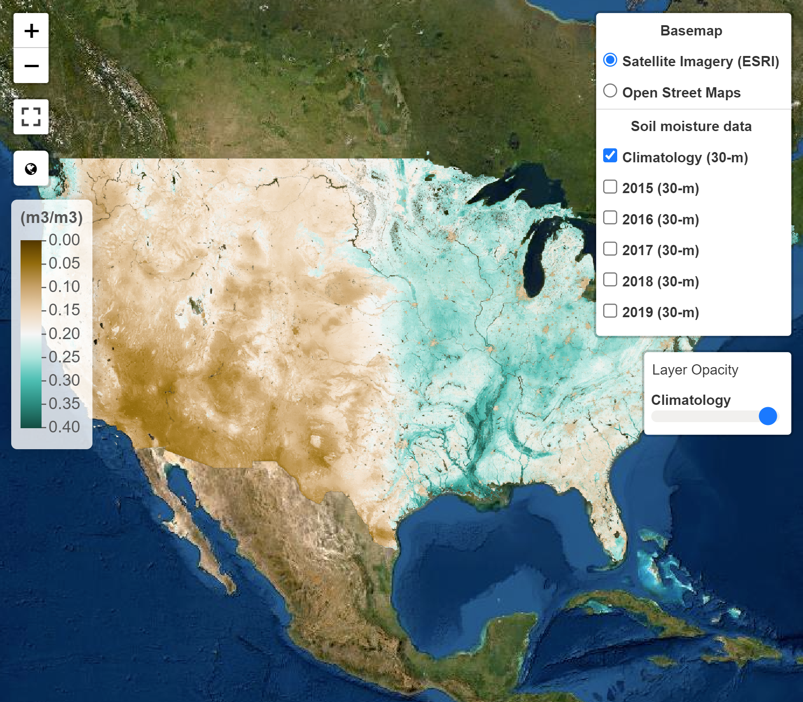

## Hyper-resolution satellite-based surface soil moisture over the continental United States

SMAP-HydroBlocks (SMAP-HB) is a hyper-resolution satellite-based surface soil moisture product at 30-m resolution over the continental United States (2015-2019). This dataset combines microwave satellite remote sensing, hyper-resolution land surface model, radiative transfer modeling, machine learning, and in-situ observations to obtain hydrologically consistent soil moisture estimates of the top 5-cm of the soil.

Our approach is built upon HydroBlocks, a hyper-resolution land surface model that leverages the spatial patterns over the landscape by implementing a hierarchical clustering algorithm to define its mesh ([Chaney et al., 2021](../publication/2021_chaney_hydroblocks_two_way_coupling)). HydroBlocks groups the fine-scale drivers of the landscape spatial heterogeneity (e.g., 30-m land cover, soil properties, topography data) into complex tiles/clusters of similar hydrologic behavior. This clusters are called Hydrologic Response Units (HRUs). By simulating hydrological processes with clusters/HRUs instead of regular grids, HydroBlocks yields an effective 30-m spatial resolution while leveraging the complex physics of land surface models and reducing the system's dimensionality and computational requirements.

To develop the SMAP-HydroBlocks dataset, we coupled HydroBlocks model with a Tau-Omega Radiative Transfer Model (HydroBlocks-RTM) to simulate the soil surface brightness temperature, and we merged it with the NASA's Soil Moisture Active-Passive (SMAP) L3 Enhanced 9-km brightness temperature product ([SMAP L3E](https://nsidc.org/data/SPL3SMP_E/versions/3)). For merging cluster-based model and grid-based satellite data we developed a cluster-based spatial Bayesian scheme ([Vergopolan et al., 2020](../publication/2020_vergopolan_combining)). We parameterized this merging scheme by regionalizing relationships extracted from satellite, models, and in-situ soil moisture observations using machine learning ([Vergopolan et al., 2021](../publication/2021_vergopolan_SMAPHydroBlocks)). With the fused brightness temperature, the inverse HydroBlocks-RTM model is applied to retrieve the SMAP-HydroBlocks (SMAP-HB) soil moisture estimates.

### Data Visualization

SMAP-HydroBlocks long-term and annual climatology at 30-m resolution are shown in the interactive visualization below. As a note, data is best shown in chrome and firefox browsers; otherwise, spatial resolution may be degraded.

{}Open Fullscreen{}

### Conference Presentation

This research was presented at the American Geophysical Union 2020 Virtual Fall Meeting. Check out the video presentation below for more details on the approach, input data, and validation results.



### Data availability

The SMAP-HB surface soil moisture dataset at is available at the the time of SMAP satellite overpass and at 30-m resolution (2015-2019). In regular geographic coordinates comprises a 22 TB dataset. Due to storage limitation of online repositories, data is made available at the HRU level at 6-h resolution (time, hru) resulting in a compressed to 31.5 GB dataset. A python script and instructions to post-process and remap the data from the HRU-level into geographic coordinates (time, latitude, longitude) is provided at [GitHub](https://github.com/NoemiVergopolan/SMAP-HydroBlocks_postprocessing). An aggregated version at 1-km 6-h resolution at geographic coordinates (time, latitude, longitude) comprising 29.4 GB is also made available. Data are open license and available for download [here](https://zenodo.org/record/5206725). Different subsets of the data can also be made available on request to Noemi Vergpolan (noemi.v.rocha@gmail.com). 

**Note**: SMAP-HydroBlocks is an experimental dataset and is continuously under development. Before application, please read the [Usage Notes](https://www.nature.com/articles/s41597-021-01050-2#Sec9) to understand its potentials and caveats.

### Data citation

Please cite the following paper when using the dataset in any publication:

Vergopolan, N., Chaney, N. W., Beck, H. E., Pan, M., Sheffield, J., Chan, S., & Wood, E. F. (2020). Combining hyper-resolution land surface modeling with SMAP brightness temperatures to obtain 30-m soil moisture estimates. Remote Sensing of Environment, 242, 111740. https://doi.org/10.1016/j.rse.2020.111740

Vergopolan, N., Chaney, N.W., Pan, M., Sheffield, J., Beck, H. E., Ferguson, C. R., Torres-Rojas, L., Sadri, S., & Wood, E. F. (2021). SMAP-HydroBlocks, a 30-m satellite-based soil moisture dataset for the conterminous US. Scientific Data 8, 264. https://doi.org/10.1038/s41597-021-01050-2

